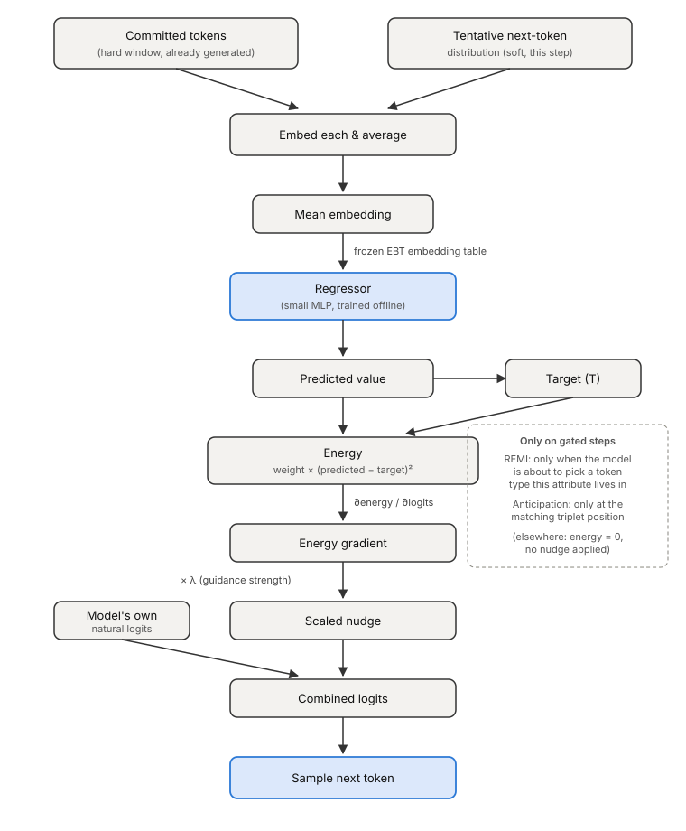

# How single-attribute control works (R³ guidance)

Reference doc for the mechanism behind every attribute-guided generation in
this project (Single Attribute and Compose in the demo, all the listening
sweeps in `attribute_control/`) — what λ and target actually are, and how a
small trained regressor turns into a live nudge on generation. Based on
Du et al. 2023, "Reduce, Reuse, Recycle" (R³).

## The mechanism

Two things happen at different times:

1. **Offline, once per attribute**: a small MLP regressor (`NoteDensityRegressor`)
   is trained to predict an attribute's value (e.g. "how loud is this
   passage?") from the *mean embedding* of a window of tokens, using the base
   EBT model's own frozen embedding table. It's trained on real windows from
   the training data with the real attribute value as the label — see
   `attribute_control/train_density_regressor.py`.

2. **At generation time, on every gated step**: recent committed tokens plus
   the model's current tentative next-token distribution get embedded and
   averaged, fed through the regressor to get a **predicted** value, compared
   to the **target**, and the resulting gradient — scaled by **λ** — gets
   added directly onto the model's own logits before sampling. The model
   still generates on its own; guidance just leans on the sampling
   distribution at the moments that matter.

## Gating: guidance doesn't fire on every step

Nudging a Bar or Position token toward "louder" makes no sense — attributes
only have a real lever on specific token types. Guidance is gated off
everywhere else:

- **REMI**: only active on the step right before the model would pick a
  token of the relevant type (a Velocity token for the velocity attribute,
  a Pitch token for pitch_register, etc.) — see `_remi_step_is_relevant()`.
- **Anticipation**: only active at the matching position in the fixed
  (time, duration, note) triplet cycle — see `_anticipation_step_is_relevant()`.

This is also why composing multiple attributes can behave differently
depending on which ones are combined: attributes that share a gate (e.g.
density + polyphony) genuinely sum their energy terms together at the same
step; attributes with non-overlapping gates (e.g. velocity + duration) rarely
fire on the same step at all, so their guidance interacts far less directly
than the shared-λ framing might suggest.

## λ (lambda) — guidance strength

The scale factor on the energy gradient before it's added to the model's
logits. This is the one knob that trades off target-tracking accuracy
against musical coherence:

- **Too low**: negligible nudge — achieved value barely moves toward target.
- **Too high**: the nudge overwhelms the model's own coherent next-token
  judgment — this is the mechanism behind every cacophony/degraded-musicality
  finding in this project (see
  `docs/thesis_findings/2026-09-24_remi_guidance_strength_sweeps.md`).

There is no single correct λ — the sweet spot is attribute-specific (and,
per the guidance-sweep finding, direction-specific too), which is the whole
reason the listening sweeps exist: to find where each attribute's own
accuracy/error/musicality tradeoff actually sits.

## T (target) — not sampling temperature

In the demo's Single Attribute variant labels ("Parameters: λ = 0.030,
T = 0.700"), **T is the target value**, not sampling temperature — it's the
attribute value generation is being asked to hit (T=0.700 → aim for
velocity ≈0.70). Sampling temperature is a separate, unrelated setting
(`infer_temp`) controlling how random the base model's own token sampling
is, independent of any guidance, and isn't part of this label at all. Worth
being explicit about since the abbreviation invites the wrong reading.

## Why the regressor has to match the EBT checkpoint it was trained on

The regressor's input is a *mean embedding vector* — a point in the base
model's own embedding space. Embeddings keep changing throughout continued
pretraining, so a regressor trained against one checkpoint's embedding
geometry gets fed numerically different vectors if used with a later
checkpoint, and its predictions become close to arbitrary with respect to
what's actually true for that generation — which then means step 2's
"gradient toward the target" pushes in a close-to-arbitrary direction
instead of a meaningful one, at every gated step throughout the whole
generation. See `docs/training_runs.md`'s "Regressor-checkpoint pairing"
section for which checkpoint each currently-active regressor actually
matches.

## See also

- `docs/thesis_findings/2026-09-22_anticipation_attribute_guidance_was_missing.md`
  — the bug where this whole mechanism was silently never wired into
  Anticipation generation at all.
- `docs/thesis_findings/2026-09-24_remi_guidance_strength_sweeps.md` — the
  actual accuracy/error/musicality-vs-λ data behind the "too high" claim
  above, including the up/down direction asymmetry.
- `docs/thesis_findings/2026-09-24_corpus_attribute_distributions.md` — why
  some targets are much harder to hit than others regardless of λ (the
  target itself can sit in a region with ~no real training density).
