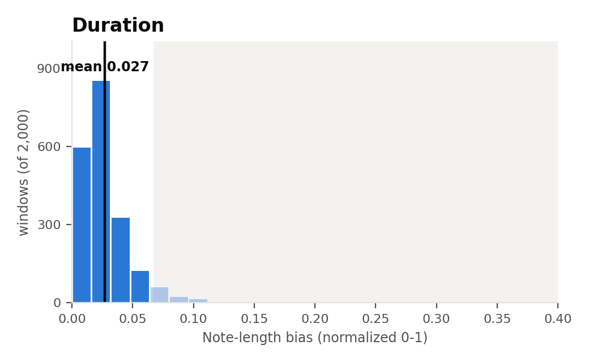
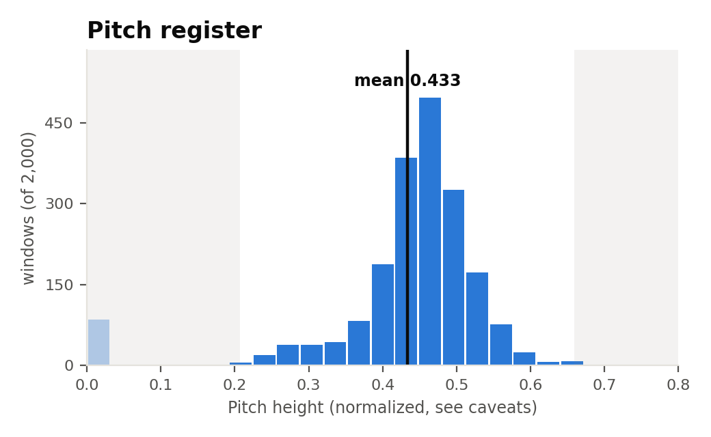

# Anticipation corpus attribute distributions

**Date:** 2026-09-24
**Reproduce with:** `attribute_control/compute_corpus_histograms.py --tokenizer Anticipation-Arrival-Time`
**REMI counterpart:** `2026-09-24_corpus_attribute_distributions.md`

## The question

Same question as the REMI corpus-distributions finding, for the Anticipation
tokenizer: what do velocity/duration/pitch_register actually look like in
real training data, and which guidance targets are asking the model to
extrapolate? Anticipation only has two attributes here — its vocabulary has
no velocity field at all (see `compute_velocity`'s docstring), so only
duration and pitch register apply.

## Method

Same as the REMI version, with one addition required specifically for
Anticipation: raw stored sequences carry a leading `AUTOREGRESS`/`ANTICIPATE`
mode marker, and `ANTICIPATE`-mode sequences (~90% of training data)
interleave real event triplets with anticipated-control triplets. Every
window sampled here is first cleaned with the same `_anticipation_triplets()`
pass `attributes.py` and (as of today) `train_density_regressor.py` both use
before slicing a window — skipping this was the exact windowing bug found
and fixed earlier today (see `docs/diary/2026-09-24.md`), and this histogram
would have silently reproduced it otherwise. 2,000 sampled windows from the
Anticipation train split (14,711,045 sequences total).

## Result

| Attribute | Mean | Std dev | Observed range | Shape |
|---|---|---|---|---|
| Duration | 0.027 | 0.020 | 0.0 – 0.215 | Even more extreme right-skew than REMI's duration — ~90% of mass in the bottom two bins |
| Pitch register | 0.433 | 0.113 | 0.0 – 0.766 | Tight real hump around 0.4–0.55, plus an isolated cluster of ~85 windows at exactly 0.0 |

## Interpretation

- **Duration is even more concentrated near zero than REMI's** (mean 0.027
  vs. REMI's 0.051, on the same normalized encoding scale used for
  Anticipation — see `compute_duration_bias`'s docstring: Anticipation
  encodes real absolute duration in seconds, normalized by
  `MAX_DURATION_IN_SECONDS`, a different mechanism from REMI's bin-rank
  approach). Any duration target above roughly 0.07 is already off the
  visible histogram — an even tighter effective safe range than REMI's.
- **Pitch register's isolated zero-cluster looks like the same fallback
  artifact identified in the REMI finding** — `compute_pitch_register`'s
  Anticipation branch returns `0.0` when a window has no valid non-drum
  pitched notes (silence, drums-only, or too short), and a clean spike
  isolated from the rest of the distribution is the same signature seen in
  REMI's histogram. Not fully confirmed the same way (Anticipation's pitch
  formula, unlike REMI's, technically *can* reach 0.0 from a genuine MIDI
  pitch-0 note, so this is slightly less certain than the REMI case) — worth
  checking before citing this tail as either "real" or "artifact."
- The real, non-zero hump for pitch register (mean 0.433) lands close to
  REMI's own pitch_register mean (0.401–0.450 depending on sample) — makes
  sense, since both tokenizers are describing the same underlying corpus of
  real songs, just through different vocabularies.

## Caveats

- Same window-count caveat as the REMI version: n=2,000, one window per
  sampled song.
- The pitch_register zero-cluster's cause (fallback vs. genuine) is less
  certain here than for REMI (see above) — flagged as open, not resolved.
- These corpus distributions are independent of any regressor or checkpoint
  — they describe the training data itself, not what any particular model
  learned from it.

## Open threads

- Confirm whether Anticipation's pitch_register zero-cluster is a genuine
  fallback artifact (as strongly suspected) by checking whether those
  specific windows are drum-only/silent.
- A comprehensive Anticipation guidance-strength sweep (accuracy/MAE/musicality
  vs. λ, matching `2026-09-24_remi_guidance_strength_sweeps.md`) has not yet
  been run — existing Anticipation sweep runs in wandb are either small
  exploratory tests or predate today's regressor-training windowing fix, so
  none are usable for this comparison yet.
