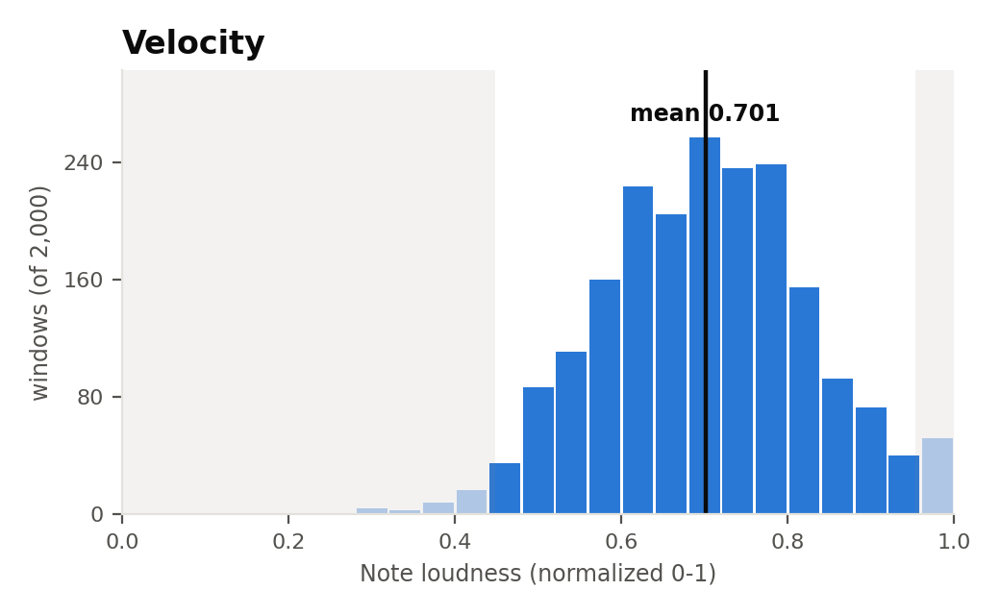
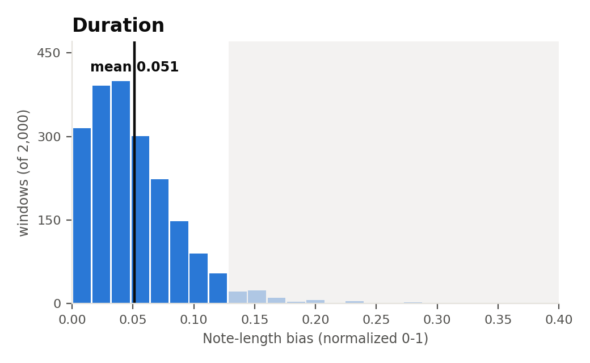
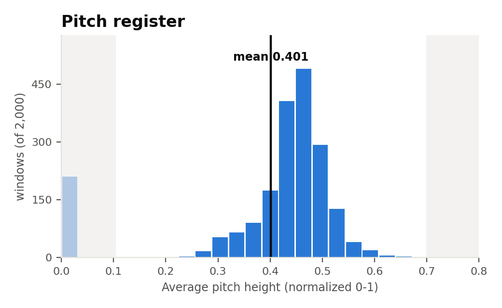

# Corpus attribute distributions: what's actually in-range for guided generation

**Date:** 2026-09-24
**Reproduce with:** `attribute_control/compute_corpus_histograms.py`
**Interactive version:** https://claude.ai/artifact/1hMqrAMwUPMowqqVsGkuZN

## The question

Attribute-guided generation pushes velocity, duration, or pitch register
toward a chosen target. `attribute_control/corpus_stats.json` already had
each attribute's mean/stdev from an earlier pass, but a single mean/stdev
pair assumes a roughly symmetric, well-behaved distribution — which matters
because two separate listening investigations this project has already run
(pitch register's up-vs-down quality asymmetry; duration's compose-lambda
sensitivity) both trace back to the corpus not actually looking like that.
This asks directly: what do these distributions really look like, and which
guidance targets are asking the model to extrapolate outside them?

## Method

Sampled 2,000 real 256-token windows at random offsets from 2,000 randomly
chosen songs in the REMI training split (giga-midi, 137,177 songs total,
seed 0), and computed each attribute's rule-based value
(`attribute_control/attributes.py`, the same functions used to score
"achieved" values everywhere else in this project) on every window directly
— no model involved, just the real token data.

## Result

**Important correction**: none of these three metrics are actually normalized
to a uniform [0, 1] — each is a different formula over REMI's own token IDs,
and the *theoretical* reachable range (what a real note can ever produce)
differs per attribute:

| Attribute | Formula (REMI) | Theoretical range | Mean | Std dev | Observed range | Shape |
|---|---|---|---|---|---|---|
| Velocity | `(3 + 4·(id−94)) / 127` | **[0.024, 1.0]** | 0.701 | 0.126 | 0.132 – 1.0 | Roughly bell-shaped, mild left skew, small ceiling bump at 1.0 |
| Duration | `(id−126) / 63` | **[0.0, 1.0]** (exact) | 0.051 | 0.039 | 0.0 – 0.295 | Sharply right-skewed — ~90% of mass in the bottom quarter of the axis |
| Pitch register | `(id+16) / 127` | **[0.165, 0.858]** | 0.401 | 0.149 | 0.0 – 0.677 | Right-skewed hump around 0.4–0.5, plus an isolated cluster of ~210 windows sitting exactly at 0.0 (see below — this is *below* the theoretical floor) |

Velocity's floor isn't 0 because MIDI velocity 0 means "note off," not a real
quiet note — REMI's velocity vocabulary starts at raw value 3. Duration's
range genuinely is exactly [0,1] (rank-normalized over 64 ordered bins), so
its unobserved values near 1.0 are just rare in real music, not unreachable —
a larger sample would likely turn some up. Pitch register's formula can
**never** produce exactly 0.0 from a real note (its floor is 0.165) — which
directly resolves the open question below.

(Shaded regions mark roughly mean ± 2σ — everything outside it is what
"out of distribution" means in the table below.)

## Interpretation

- **Duration is the most skewed of the three by far.** The mean±2σ band
  (≈ -0.03 to 0.13) is nearly the whole visible mass, but that's because the
  real distribution is a steep exponential-like decay, not because targets
  up to 0.13 are actually well-supported — the 90th-percentile-ish cutoff is
  closer to 0.10. A target like 0.69 (used in a recent demo test) isn't "a
  few σ out," it's essentially zero real training density — consistent with
  that generation producing a conspicuously long, unusual clip.
- **Pitch register's asymmetry explains the earlier up/down quality finding.**
  The bulk of real windows sit at or below the mean; the right tail (high
  pitch) thins out well before the left tail does. This is the same
  asymmetry already identified via skewness (-0.32) in the REMI pitch-register
  listening sweep — pushing pitch up runs out of real data faster than
  pushing it down, independent of λ.
- **The ~210-window spike at exactly pitch_register = 0.0 is confirmed to be
  a fallback value, not real low-pitch content.** `compute_pitch_register`'s
  formula can only ever produce values in [0.165, 0.858] from an actual note
  — 0.0 is the function's explicit fallback when a window contains no valid
  non-drum pitched notes at all (silence, drums-only, or a too-short window).
  These 210 windows should be excluded (or handled separately) in any
  downstream use of this distribution, e.g. corpus-mean/stdev calculations —
  including left in, they pull the mean down and add spurious low-end mass
  that isn't musical content at all.
- **Velocity is the best-behaved of the three** — closest to symmetric, so
  mean ± 2σ is a reasonable approximation of "in distribution" for it
  specifically, unlike the other two.

## Caveats

- n=2,000 windows, one random window per sampled song — a song contributing
  one window doesn't capture its own internal variation, so this describes
  the corpus's *window-level* distribution, not a per-song one.
- The ±2σ shading is a convenient rule of thumb, not a principled boundary —
  see duration and pitch register above, where the real tail shape makes a
  symmetric cutoff a poor fit.
- These are REMI-tokenizer numbers only; Anticipation's own attribute
  distributions haven't been separately computed and may differ.

## Open threads

- Anticipation-tokenizer corpus distributions (same method, different
  tokenizer) — not yet run.
- **The pitch_register mean/stdev reported above (and in
  `corpus_stats.json`) are contaminated by the ~210 fallback-zero windows** —
  they pull the mean down and widen the spread with values that aren't real
  musical content. A corrected recomputation excluding windows with no valid
  pitched notes (rather than treating them as `0.0`) would give a tighter,
  more accurate picture of the genuine pitch_register distribution — not yet
  done.
