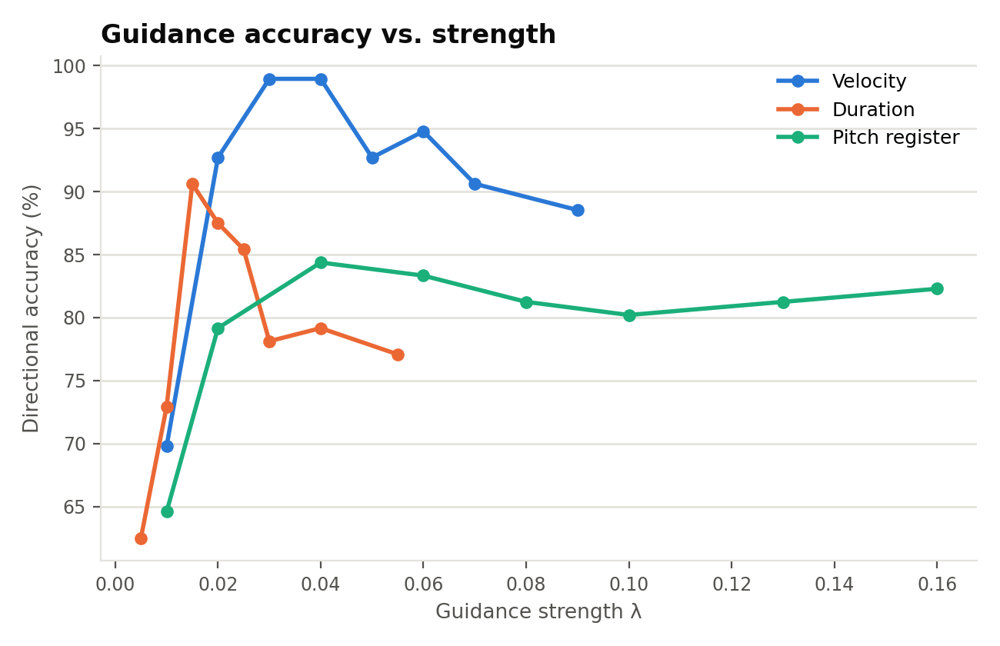
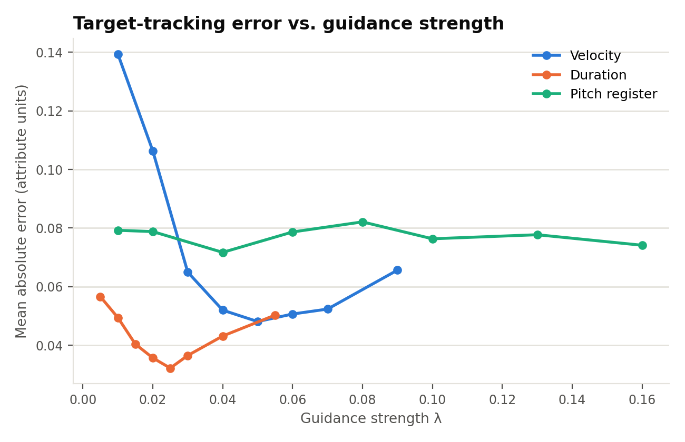
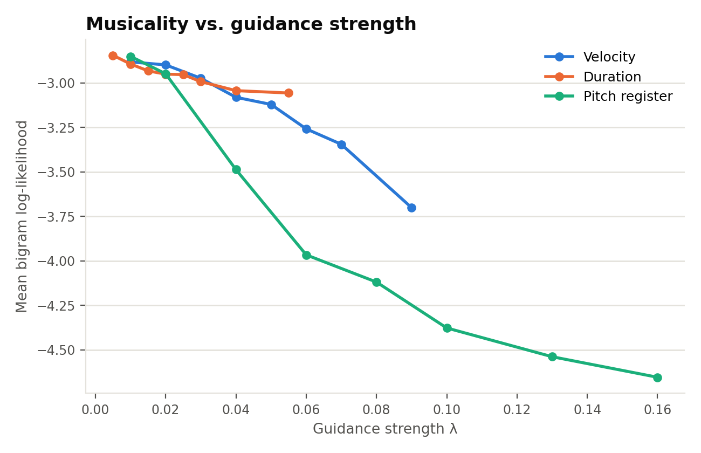
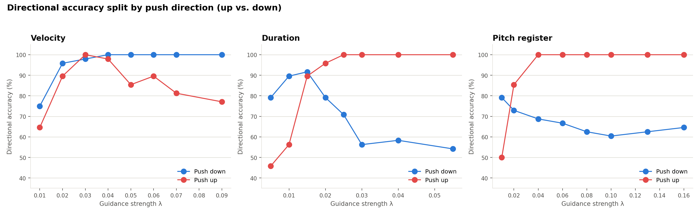

# REMI attribute-guidance strength sweeps: accuracy, error, and musicality vs. λ

**Date:** 2026-09-24 (rebuilt from the comprehensive sweeps run 2026-09-22)
**Reproduce with:** `attribute_control/listen_density_sweep.py` (see
`job_scripts/mus/attr_control/listen_density_sweep.sh` for the exact
invocations), wandb runs `thesis-velocity-remi-comprehensive` (c5gxbfcj),
`thesis-duration-remi-comprehensive` (yuah1i6k),
`thesis-pitch_register-remi-comprehensive` (97zhcwb5), project
`mus_symb_attr_control`.

## The question

For each REMI attribute (velocity, duration, pitch register), how does
guidance strength λ trade off directional accuracy, target-tracking error,
and musical coherence? This is the data behind several conclusions used
elsewhere in this project (the tuned `_LAMBDA_RANGES` defaults in
`demo/app.py`, the pitch-register up/down asymmetry finding) — rebuilt here
as static, citable figures instead of only living in an interactive wandb
dashboard or a Claude-hosted artifact link.

## Method

16 prompts x a per-attribute λ grid x 3 baseline repeats each (768 guided
samples per attribute), REMI tokenizer, EBT checkpoint job21290401 (the one
these regressors were originally trained against — see
`docs/training_runs.md`'s regressor-pairing note). For every guided sample:

- **Directional accuracy**: did the achieved value move in the same
  direction (up/down relative to that prompt's own baseline) as the target
  asked for?
- **Mean absolute error**: `|achieved_value - (baseline_value + target_delta)|`,
  in each attribute's own normalized units (see
  `2026-09-24_corpus_attribute_distributions.md` for what those units and
  their real ranges are).
- **Musicality**: mean bigram log-likelihood against a real-corpus bigram
  table (less negative = more musically plausible; this is the same
  `musicality_metrics.py` machinery used throughout this project).

## Results

The aggregate accuracy curves above average over both push directions
(target above vs. below each prompt's own baseline) — splitting by direction
uncovers a pattern the average hides entirely:

For **duration** and **pitch register**, "push up" and "push down" accuracy
*cross over* as λ increases: push-up accuracy climbs to a clean 100% by
λ≈0.02–0.04, while push-down accuracy actively **degrades** over the same
range (duration: 91.7%→54.2%; pitch register: 79.2%→~62%). Velocity is the
outlier here too — both directions stay roughly matched, with push-down
consistently at or above push-up.

## Interpretation

- **The up/down accuracy crossover for duration and pitch register is the
  mirror image of the musicality asymmetry**, not a contradiction of it: push
  *up* becomes perfectly accurate at moderate λ because both attributes'
  real corpus mass sits low (duration's mean is near its own floor; pitch
  register's bulk sits at/below its mean — see
  `2026-09-24_corpus_attribute_distributions.md`), so pushing up always has
  real headroom to move into. Push *down* runs out of room to go — duration
  in particular is already hugging its floor at baseline, so "push it lower
  still" has nowhere left to go once λ is strong enough to matter, and
  accuracy collapses even though (per the bigram_ll chart) the down-pushed
  samples still sound *more* musical than the up-pushed ones. In short: down
  pushes sound better but increasingly can't reach their target; up pushes
  reliably reach their target but at a growing musical cost. Neither
  direction is simply "the good one" — they fail in different currencies.
- Velocity doesn't show this crossover because its real corpus distribution
  (see the corpus-distributions finding) is the most balanced of the three —
  there's real headroom in both directions from a typical baseline.

- **Velocity** is the best-behaved: accuracy climbs sharply from 70% (λ=0.01)
  to a clean 99% plateau at λ=0.03–0.04, and error bottoms out in the same
  region (~0.048–0.052) before both start degrading again past λ≈0.05 as
  musicality (bigram_ll) drops off. λ=0.03–0.04 is the genuine sweet spot,
  matching the tuned default (0.03) in `_LAMBDA_RANGES`.
- **Duration** peaks earlier and lower: accuracy tops out around λ=0.015
  (~91%) then *declines* through λ=0.055 even as error keeps improving until
  λ=0.025 — accuracy and error don't move together here, so error alone
  would have picked a slightly-too-strong λ. Musicality declines only mildly
  across this whole range, consistent with duration being the most
  guidance-tolerant of the three attributes (also consistent with the
  corpus-distributions finding that duration's regressor doesn't need
  `note_only_window`-style fixes — the raw windowing dilution that hurts
  pitch_register barely touches duration).
- **Pitch register** never reaches velocity's accuracy ceiling (plateaus
  around 80–84%) and pays for every λ increase with a much steeper
  musicality cost — bigram_ll drops from -2.85 at λ=0.01 to -4.65 at λ=0.16,
  roughly **4x the rate of velocity's own decline** over a comparable
  accuracy gain. This is the guidance-strength side of the same fragility
  documented in the corpus-distribution and up/down-asymmetry findings:
  pitch register has the least real training density to work with, so
  pushing it costs more musical coherence per unit of λ than the other two
  attributes.
- Across all three attributes, **error and accuracy are not interchangeable
  proxies for "good λ"** — duration's error/accuracy curves actively
  disagree over part of the range. Any future λ-tuning work should look at
  more than one of these three metrics before picking a default.

## Caveats

- λ grids differ per attribute (tailored to each one's own previously-known
  working range, not a shared grid), so the x-axis ranges shown aren't
  directly comparable in extent — only the shapes/trends within each line
  are meaningful.
- This used EBT checkpoint job21290401, which the REMI regressors are being
  retrained away from as of this writing (see `docs/training_runs.md`) — a
  rerun against the new checkpoint would be needed to confirm these curves
  still hold once that retrain finishes.
- Accuracy/error/musicality are averaged over 16 prompts x 3 repeats per λ
  point (96 guided samples) — enough to see clear trends, not enough to
  report tight confidence intervals.

## Open threads

- Rerun this same sweep once the REMI regressor retrain (jobs
  23662484/23662485/23662486) finishes, to confirm the λ sweet spots found
  here still hold against the new checkpoint.
- A dedicated REMI pitch_register cacophony sweep (both directions, λ=0.01–0.07,
  ±1σ/2σ/3σ targets) is running separately (job 23658344,
  `thesis-pitch_register-remi-cacophony-sweep`) — not yet finished.
