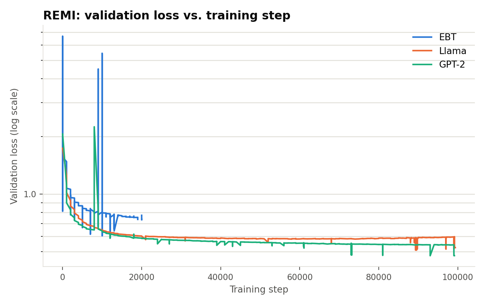
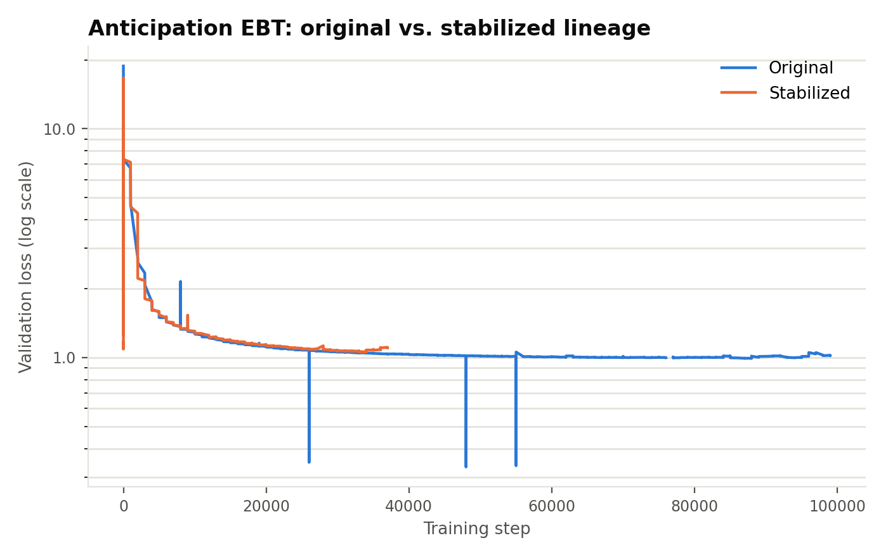

# Validation loss progression: EBT vs. baselines, and Anticipation's two lineages

**Date:** 2026-09-25
**Reproduce with:** pull `run.history(keys=["valid_loss", "_step"])` for each
wandb run ID below (`rceccatelli-eth-z-rich/mus_symb_ebt_pretrain` and
`.../mus_symb_baseline_pretrain`), concatenate by step, and see
`attribute_control/sweep_tables/val_loss_histories.json` for the already-pulled
data these figures were built from.

## Why this needed extra care

Each EBT lineage is split across multiple wandb run IDs, not one continuous
run — the self-resubmitting job script (`job_scripts/mus/pretrain/ebt_s1.sh`)
doesn't always resume into the same wandb run (see the checkpoint-resume
reliability fix, 2026-09-24). Confirmed via each checkpoint directory's own
`wandb_run_id.txt`:

| Lineage | Distinct wandb run IDs |
|---|---|
| EBT REMI (s1) | 4 |
| EBT Anticipation, original | 2 |
| EBT Anticipation, stabilized | 8 |
| Llama / GPT-2 (REMI baselines) | 1 each |

Every EBT chart below stitches all of a lineage's run IDs together by step
number to get the real, complete history — pulling just the most recent run
ID (as `docs/training_runs.md`'s hyperparameter table does, deliberately,
since that table only needs current values) would silently drop most of the
actual training history for these lineages.

## Result

Both use a **log-scale y-axis** deliberately, not a cropped one — no data
points are removed or hidden. A linear axis is dominated by two things that
are both real, not the same kind of artifact: the genuinely high loss in the
first few dozen steps of training (expected — the model hasn't learned
anything yet), and the already-documented spurious post-resume validation
readings (`docs/thesis_findings/2026-09-22_anticipation_loss_vocab_normalization.md`'s
correction note) that occasionally spike well above or dip well below the
real local trend right after a resume. Log scale compresses both without
erasing either, and the converged region — the part actually worth reading —
becomes visible.

## Interpretation

- **REMI**: EBT, Llama, and GPT-2 all follow a similar early shape, but
  EBT's own logged history only extends to ~step 20,000 (the most recent
  segment available), while Llama/GPT-2 both ran to ~99,000+. Over the range
  where they overlap, EBT's validation loss sits **visibly higher** than
  Llama/GPT-2's (~0.7–0.8 vs. ~0.55–0.6 around step 10,000–20,000) — though
  this comparison should be read cautiously: EBT's `valid_loss` comes from a
  different training objective (energy-based, via MCMC refinement) than
  Llama/GPT-2's plain next-token cross-entropy, so the two numbers aren't
  guaranteed to be on identical footing the way, say, two cross-entropy
  losses from the same vocabulary would be. The step-budget gap documented
  in `docs/training_runs.md` (EBT covers roughly half the data per step
  versus the baselines) is the confirmed, apples-to-apples explanation for
  why EBT is *earlier* in training at any given step; whether its loss would
  fully close this visible gap once genuinely caught up is not something
  this data alone can answer.
- **Anticipation, original vs. stabilized**: the two lineages track each
  other almost exactly over the steps where both have data (up to ~37,000) —
  the stabilized lineage's addition of Langevin noise, a replay buffer, and
  randomized MCMC step size did **not** produce a visibly different loss
  trajectory. This is actually consistent with what stabilization was meant
  to do: the original motivation was Anticipation's higher, less stable
  gradient norms (2–2.65x REMI's), not a worse loss value — these changes
  target training *robustness*, not necessarily a lower converged loss. The
  original lineage's longer history (continuing to ~99,000 steps) settles
  into a very flat ~1.0–1.05 plateau, still showing occasional post-resume
  artifact dips (e.g. near steps 26,000, 48,000, 55,000) consistent with the
  same already-documented mechanism.

## Caveats

- EBT REMI's history stops at ~20,000 in this data pull — training has
  continued since (see `docs/diary/`); this chart reflects wandb history at
  the time of pulling, not the current step count.
- The remaining visible spikes/dips are the known spurious post-resume
  artifact, not filtered out here (log scale only compresses their visual
  weight) — don't read them as real momentary quality changes.
- EBT's loss is not necessarily numerically comparable to Llama/GPT-2's on
  an absolute basis (different training objectives) — the comparison here is
  about *trajectory shape and step coverage*, not a claim that one model is
  strictly better than another at a given loss number.

## Open threads

- Re-pull once EBT REMI's currently-running training job (job 23666767, on
  `mit_normal_gpu` as of 2026-09-24) has logged enough new history to extend
  this chart meaningfully past step 20,000.
- Confirm whether EBT's own valid_loss is truly incomparable to the
  baselines' — check whether it's actually cross-entropy of the final MCMC
  step's prediction only, or something else, before ever claiming
  EBT-vs-baseline superiority/inferiority in the thesis text.
