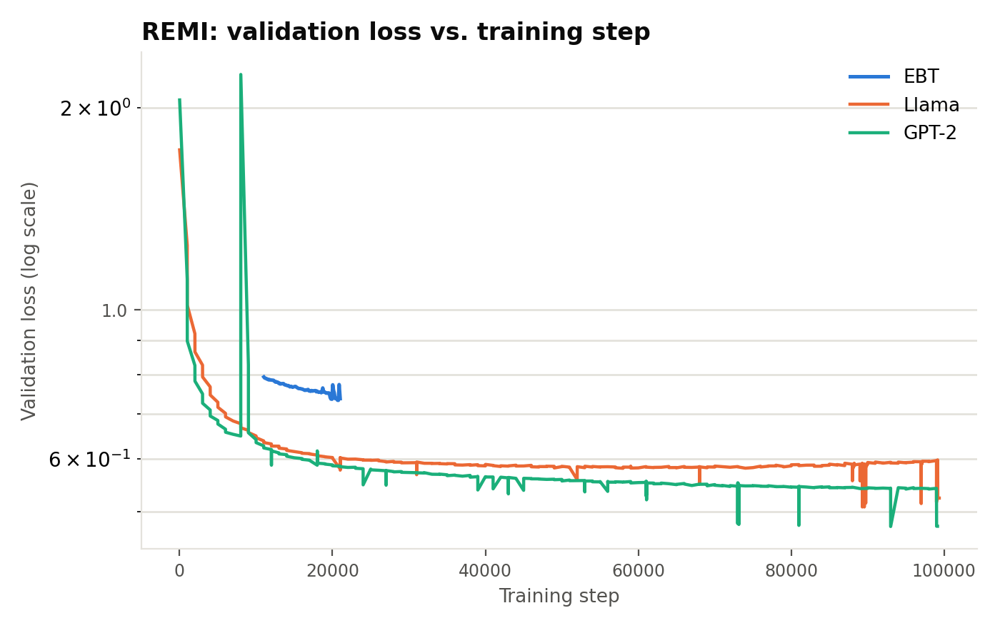
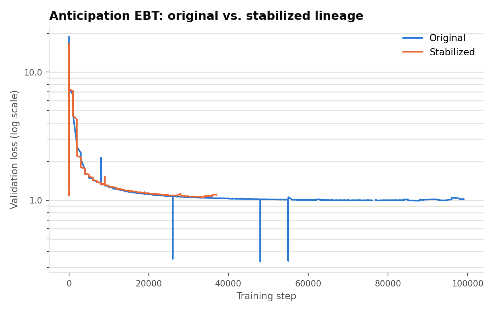

# Validation loss progression: EBT vs. baselines, and Anticipation's two lineages

**Date:** 2026-09-25
**Reproduce with:** for Llama/GPT-2 and the Anticipation lineages, pull
`run.history(keys=["valid_loss", "_step"])` per wandb run ID below
(`rceccatelli-eth-z-rich/mus_symb_ebt_pretrain` and
`.../mus_symb_baseline_pretrain`) — see
`attribute_control/sweep_tables/val_loss_histories.json` for the already-pulled
data. **For REMI specifically, use the checkpoint filenames directly**
instead (`ls .../checkpoints/ebt-symb-small-remi-s1-job22827004_*/epoch=*.ckpt`
and its successor job directories) — see "Why this needed extra care" below
for why the wandb version is wrong for this one lineage.

## Why this needed extra care

Each EBT lineage is split across multiple wandb run IDs, not one continuous
run — the self-resubmitting job script (`job_scripts/mus/pretrain/ebt_s1.sh`)
doesn't always resume into the same wandb run (see the checkpoint-resume
reliability fix, 2026-09-24). Confirmed via each checkpoint directory's own
`wandb_run_id.txt`:

| Lineage | Distinct wandb run IDs |
|---|---|
| EBT REMI (s1) | 4 |
| EBT Anticipation, original | 2 |
| EBT Anticipation, stabilized | 8 |
| Llama / GPT-2 (REMI baselines) | 1 each |

**A first version of this chart stitched all of a lineage's wandb run IDs
together by step number — this was wrong for REMI, not just noisy.** Two of
REMI's four run IDs (`yy0269tr`, `8wffvj5k`) turned out to report
*overlapping* step ranges (both have data for steps 0–13,048), so merging
them by step number interleaved two different runs' readings at the same
step numbers.

Checked the actual checkpoint *files* directly instead — the real saved
weights, independent of any wandb logging — and this uncovered something
real, not just a logging artifact: **REMI's training genuinely forked into
multiple divergent branches** during 2026-08-22 to 2026-08-28 (roughly steps
7,000–12,728). At step 10,584 alone, six different job IDs each saved a
checkpoint labeled "step 10584" with six *different* loss values (0.7726,
0.6038 x3, 0.6574, 0.6650) — meaning several separate resubmissions grabbed
the same ancestor checkpoint and continued training independently, each
producing real but different weights that all inherited the same step
number. This is exactly the failure mode the checkpoint-resume-reliability
fix's commit message referred to ("cross-job collisions, incompatible
lineages") — confirmed here to have actually happened, not just a
theoretical risk.

The currently-active lineage (`job22827004` onward, leading to today's
`job23666767`) picked up one specific branch and, from step ~11,020 onward,
shows a smooth, single, self-consistent trajectory through 18 further
resubmissions all the way to the current step (~21,000) — so the *current
model* is not compromised. But the checkpoint history strictly between
steps ~7,000–12,728 doesn't represent one coherent story and shouldn't be
cited as if it does. **The REMI curve below uses only the currently-active
lineage's own checkpoint files** (step ≥ 11,020; the single step-10,584
starting point is also excluded — its value, 0.6650, shows the same
isolated-dip-followed-by-jump-back-up signature as the already-documented
spurious post-resume artifact), not the wandb merge.

Llama, GPT-2, and both Anticipation lineages have not been re-verified this
same way yet — their wandb run IDs didn't show the same overlapping-range
red flag REMI's did, but that's a weaker check than actually walking their
checkpoint files, which is what actually caught this for REMI.

## Result

Both use a **log-scale y-axis** deliberately, not a cropped one — no data
points are removed or hidden. A linear axis is dominated by two things that
are both real, not the same kind of artifact: the genuinely high loss in the
first few dozen steps of training (expected — the model hasn't learned
anything yet), and the already-documented spurious post-resume validation
readings (`docs/thesis_findings/2026-09-22_anticipation_loss_vocab_normalization.md`'s
correction note) that occasionally spike well above or dip well below the
real local trend right after a resume. Log scale compresses both without
erasing either, and the converged region — the part actually worth reading —
becomes visible.

## Interpretation

- **REMI**: EBT's clean (single-lineage) history runs from step ~11,020 to
  ~21,000, while Llama/GPT-2 both ran to ~99,000+. Over the range where they
  overlap, EBT's validation loss sits **visibly higher** than Llama/GPT-2's
  (~0.73–0.79 vs. ~0.6–0.65 around step 11,000–20,000) — though
  this comparison should be read cautiously: EBT's `valid_loss` comes from a
  different training objective (energy-based, via MCMC refinement) than
  Llama/GPT-2's plain next-token cross-entropy, so the two numbers aren't
  guaranteed to be on identical footing the way, say, two cross-entropy
  losses from the same vocabulary would be. The step-budget gap documented
  in `docs/training_runs.md` (EBT covers roughly half the data per step
  versus the baselines) is the confirmed, apples-to-apples explanation for
  why EBT is *earlier* in training at any given step; whether its loss would
  fully close this visible gap once genuinely caught up is not something
  this data alone can answer.
- **Anticipation, original vs. stabilized**: the two lineages track each
  other almost exactly over the steps where both have data (up to ~37,000) —
  the stabilized lineage's addition of Langevin noise, a replay buffer, and
  randomized MCMC step size did **not** produce a visibly different loss
  trajectory. This is actually consistent with what stabilization was meant
  to do: the original motivation was Anticipation's higher, less stable
  gradient norms (2–2.65x REMI's), not a worse loss value — these changes
  target training *robustness*, not necessarily a lower converged loss. The
  original lineage's longer history (continuing to ~99,000 steps) settles
  into a very flat ~1.0–1.05 plateau, still showing occasional post-resume
  artifact dips (e.g. near steps 26,000, 48,000, 55,000) consistent with the
  same already-documented mechanism.

## Caveats

- EBT REMI's clean history stops at ~21,000 in this data pull — training has
  continued since (see `docs/diary/`); this chart reflects the checkpoint
  files present at the time of pulling, not the current step count.
- The REMI curve deliberately excludes steps < 11,020 (the divergent-branch
  period) — this is not the same thing as "REMI training started at step
  11,020." Real training happened before that point too; it just isn't
  possible to cite a single trustworthy loss value from that specific window
  given the branching.
- The Anticipation curves (original vs. stabilized) still use the earlier
  wandb-merge methodology, not the checkpoint-file method that caught the
  REMI issue — see "Open threads."
- EBT's loss is not necessarily numerically comparable to Llama/GPT-2's on
  an absolute basis (different training objectives) — the comparison here is
  about *trajectory shape and step coverage*, not a claim that one model is
  strictly better than another at a given loss number.

## Open threads

- Re-pull once EBT REMI's currently-running training job (job 23666767, on
  `mit_normal_gpu` as of 2026-09-24) has logged enough new history to extend
  this chart meaningfully past step 21,000.
- Re-verify Llama, GPT-2, and both Anticipation lineages' validation-loss
  curves using the same direct-checkpoint-file method that caught the REMI
  branching issue, rather than trusting their wandb run IDs just because
  they didn't show an overlapping-step-range red flag — that check is weaker
  than actually walking the checkpoint files.
- Confirm whether EBT's own valid_loss is truly incomparable to the
  baselines' — check whether it's actually cross-entropy of the final MCMC
  step's prediction only, or something else, before ever claiming
  EBT-vs-baseline superiority/inferiority in the thesis text.
