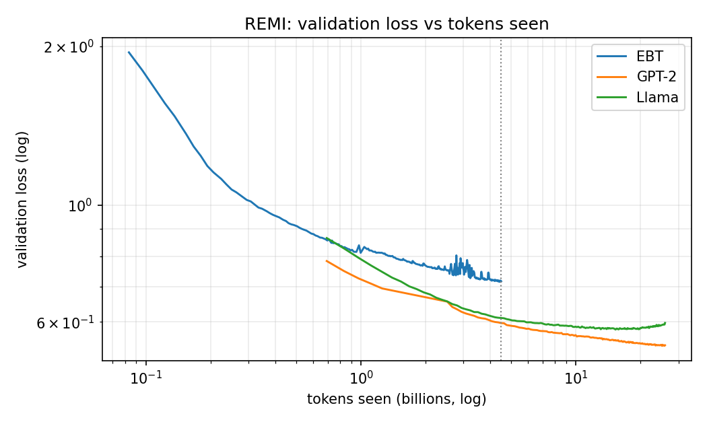
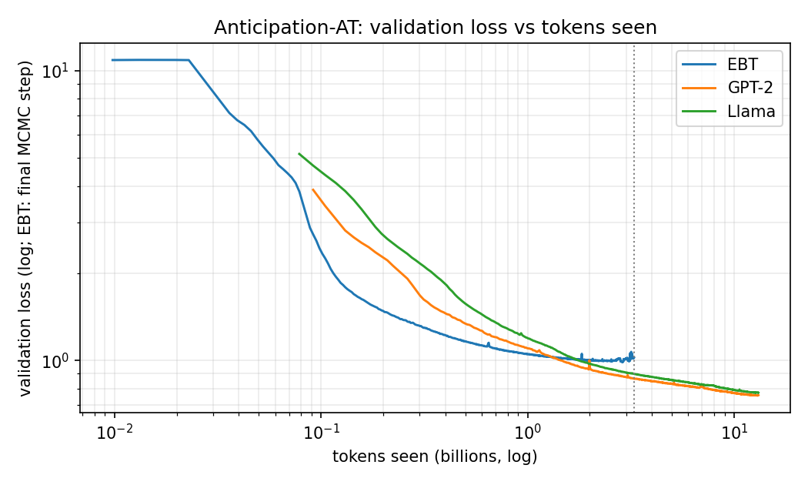

# Validation loss at matched tokens seen: EBT vs GPT-2 / Llama

_2026-10-05. Script: `eval/plot_tokens_matched_curves.py`. Figures:
`docs/figures/tokens_matched/`._

## Why
The runs used different effective batch sizes and context lengths
(`docs/training_runs.md`). When EBT stopped, the baselines had seen far more
data: REMI 26B vs 4.5B tokens, Anticipation 13.1B vs 3.3B. Final losses
mostly reflect that, so this compares the models at equal tokens seen.

## Method
- Each model's wandb runs come from the `wandb_run_id.txt` in its checkpoint
  dirs. Overlapping steps are resolved "latest run wins".
- Post-resume validation artifacts are dropped: dips >1.5% below and
  spikes >10% above the median of ±6 neighbouring readings.
- Tokens = step × effective batch × context: EBT REMI 256×512, EBT Ant
  64×512, baselines REMI 256×1024, baselines Ant 128×1024.
- "Loss at budget" is the median of the readings within ±5% of that budget.

## Result

Loss (EBT: last MCMC step, `valid_final_loss`) and **perplexity = exp(loss)**:

| REMI | 0.5B | 1.0B | 2.0B | 4.5B (EBT stop) | final |
|---|---|---|---|---|---|
| EBT | 0.911 / 2.49 | 0.814 / 2.26 | 0.764 / 2.15 | **0.716 / 2.05** | 0.714 / 2.04 (4.5B) |
| GPT-2 | 0.783 / 2.19 | 0.726 / 2.07 | 0.672 / 1.96 | 0.597 / 1.82 | 0.542 / 1.72 (26B) |
| Llama | 0.866 / 2.38 | 0.794 / 2.21 | 0.680 / 1.97 | 0.610 / 1.84 | 0.597 / 1.82 (26B) |

| Anticipation-AT | 0.5B | 1.0B | 2.0B | 3.3B (EBT stop) | final |
|---|---|---|---|---|---|
| EBT | **1.163 / 3.20** | **1.051 / 2.86** | 1.001 / 2.72 | 1.021 / 2.78 | 1.022 / 2.78 (3.3B) |
| GPT-2 | 1.336 / 3.80 | 1.101 / 3.01 | 0.933 / 2.54 | 0.864 / 2.37 | 0.758 / 2.13 (13.1B) |
| Llama | 1.563 / 4.77 | 1.193 / 3.30 | 0.974 / 2.65 | 0.897 / 2.45 | 0.774 / 2.17 (13.1B) |

**Which EBT loss / perplexity to use.** EBT's `valid_loss` is the CE
averaged over all MCMC steps. The prediction actually sampled from is the
last step's, `valid_final_loss`, which is the like-for-like counterpart of
the baselines' `valid_loss`. EBT's logged `valid_perplexity` averages
per-batch exp(loss), so it reads ~1.5% higher than exp(mean loss)
(REMI step 34,267: logged 2.073 vs exp(0.7143) = 2.043). The baselines log
exactly exp(mean loss). So report exp(`valid_final_loss`) for EBT, not the
logged value.

**MCMC refinement barely changes the prediction.** At REMI step 34,267:
initial-step loss 0.7186 → final-step 0.7143 (−0.6%). With the 2 MCMC
steps used in training, "thinking" adds very little to raw next-token
quality. The quality-vs-MCMC-steps experiment should test whether more
steps at inference help.

- **Anticipation: EBT learns faster early, then plateaus.** It has lower loss
  than both baselines up to ~1.2B tokens (−12% / −25% vs GPT-2 / Llama at
  0.5B). After that it flattens at ~1.0 while the baselines keep improving,
  so it is behind at 2B+.
- **REMI: EBT is behind at every matched budget.** For example, 0.718 vs
  0.597 / 0.610 at 4.5B.
- **Llama REMI overfits.** Its loss rises again after ~15B tokens
  (~185 epochs), so its best checkpoint is earlier than its final one.

## Context-matched check (final checkpoints, 1,000 identical validation windows)
`eval/context_matched_loss.py`, jobs 24944752 / 24948185. EBT = last MCMC step.

| perplexity | EBT @512 | GPT-2 @512 | Llama @512 | GPT-2 @1024 | Llama @1024 |
|---|---|---|---|---|---|
| REMI | 2.006 | 1.887 | 1.965 | 1.674 | 1.741 |
| Anticipation | 3.011 | 2.697 | 2.727 | 2.273 | 2.306 |

At equal context the gap shrinks a lot. REMI EBT–Llama loss gap goes
0.12 → 0.02 and EBT–GPT-2 0.18 → 0.06. Ant EBT–Llama 0.27 → 0.10 and
EBT–GPT-2 0.28 → 0.11. So the longer training/eval context explains
~60–85% of the baselines' logged advantage. The rest (with the baselines
having seen 4–6× more tokens) is what remains. EBT's first→last MCMC step:
REMI 0.6993 → 0.6964, Ant 1.1098 → 1.1024 (≤ 0.7%).

## Caveats
- Objective differs: EBT's `valid_loss` is the cross-entropy of its
  MCMC-refined prediction, not a plain next-token softmax as in the
  baselines (same caveat as `2026-09-25_validation_loss_curves.md`). Treat
  cross-model gaps as indicative. The music-quality and controllability
  evaluations are the model-agnostic comparisons.
- Context differs: the baselines train and validate at 1024 tokens, EBT at
  512. Longer context lowers per-token loss on its own, so these tables
  favour the baselines somewhat.
- Per-token loss isn't comparable across tokenizers (vocab 427 vs 55,028):
  compare within a table only.
- The REMI baseline curves start at ~0.7B tokens. Their earlier wandb runs
  aren't referenced by any surviving checkpoint dir.
- EBT REMI between ~2.5–3B tokens spans the resubmission/branching period
  (see `2026-09-25_validation_loss_curves.md`), hence the noise.
