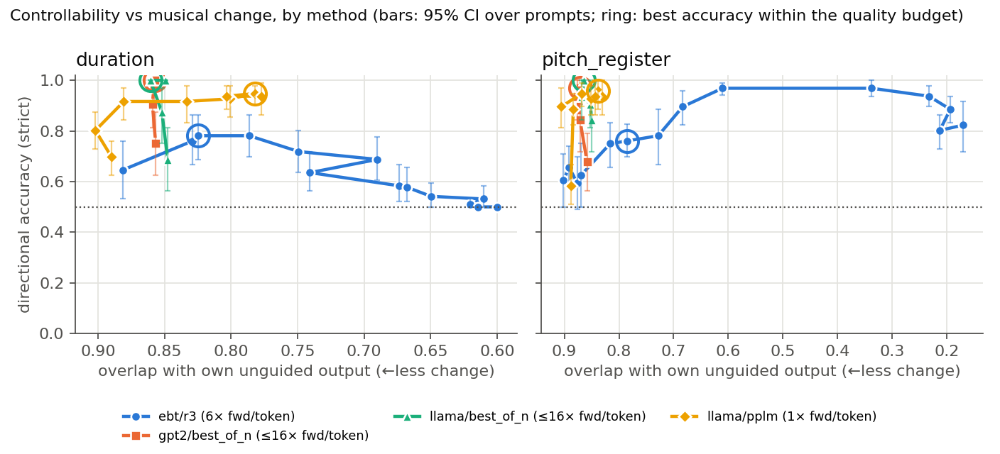

# Anticipation guidance and music quality on control-free prompts

_2026-10-09. Re-run of the Anticipation evaluation after finding that most
validation windows contain anticipated control tokens (diary 2026-10-08)._

## Why
The Anticipation data is 10× anticipation-augmented on every split: about 90%
of validation sequences are `ANTICIPATE` windows, and 41% of their tokens are
controls. Controls are real notes moved earlier in the sequence. Generation,
attribute measurement and MIDI decoding all drop them, so prompts and
"real-music" reference windows drawn from those sequences were missing notes.
In 13 of the 16 old guidance prompts the 64-token prompt contained controls,
and after stripping, prompts kept 6–21 of their 21 notes.

## What changed
- Prompts, ground truth and reference windows now come from validation
  sequences with **no control tokens at all**: 1,216 of 12,000 sampled
  (`music_EBT_logs/attr_control/ant_autoregress_val_prompts.json`). The mode
  token alone is not enough: 52 of 1,268 `AUTOREGRESS` windows ran into the
  next augmented copy of a song and still contained controls.
- 16 sweep prompts = `sorted(Random(0).sample(pool, 16))`, identical for every
  model. Everything else is as in the 2026-10-08 runs (checkpoints EBT s1
  88,800 / GPT-2 98,900 / Llama 100,000, regressors from 2026-10-05, targets
  ±0.5/1/2 corpus SD, 3 baseline draws, T = 0.7, top-p 0.9, 256 tokens).
- Jobs: EBT coarse λ 0.005…0.64 (25296307/08), EBT fine λ 0.002…0.02
  (25296410/11, from the wrap-up session), best-of-N GPT-2/Llama
  (25296309/10), unguided generation (25296312–14), reference (25296315),
  scoring (25380026).

## The old reference was thinned
Old vs control-free reference windows (500 each, means): polyphony 3.65 → 4.75,
pitch range 36.2 → 43.2 semitones, pitch-class entropy 2.19 → 2.32,
empty-beat rate 0.058 → 0.041. The old set also lost 75/500 windows to the
"< 8 pitched notes" filter (now 3).

## Unguided quality (100 songs, 98 scored)
Mean KDE overlap over the 8 quality metrics, against the **real continuations
of the same songs** scored the same way (prompt notes removed):

| | EBT | GPT-2 | Llama |
|---|---|---|---|
| mean OA vs same-song real continuations | 0.79 | **0.82** | 0.79 |
| mean OA vs random real windows | 0.76 | 0.78 | 0.76 |

Use the same-song comparison. Scoring a continuation with its prompt removed
inflates `empty_beat_rate` (real continuations: 0.17, random real windows:
0.04), which penalises every model equally against free-standing windows.
All three models are more conservative than real music: more in-scale
(0.98–0.99 vs 0.97), narrower range (~38 vs 46 semitones), more repetitive
(bar self-similarity EBT 0.20, GPT-2 0.16, Llama 0.17 vs 0.09).

## Guidance (strict accuracy, 95% prompt-bootstrap CI)

Operating points (best accuracy with harsh dissonance ≤ real mean + 1 SD and
overlap with own unguided output ≥ 0.75):

| attribute | EBT (6 fwd/token) | GPT-2 best-of-N | Llama best-of-N |
|---|---|---|---|
| duration | 0.78 [0.69, 0.86] at λ = 0.005 | 1.00 at N = 16 | 1.00 at N = 16 |
| pitch register | 0.76 [0.70, 0.83] at λ = 0.01 | 0.97 [0.91, 1.00] at N = 16 | 1.00 at N = 16 |

- **EBT's working range is narrow.** Duration accuracy peaks at λ ≈ 0.005–0.006
  (0.78) and falls back to chance (0.50) above λ ≈ 0.04: everything gets
  pushed one way. Pitch register reaches 0.97 at λ = 0.02, but at the cost of
  musical change (overlap with own unguided output 0.61); above λ ≈ 0.04 it
  turns cacophonic (harsh dissonance 0.23–0.25, scale consistency 0.70–0.79).
- **Best-of-N wins on Anticipation**, at little musical cost (overlap ≈ 0.86
  at every N). It is an *oracle* reranker: it scores candidates with the same
  function the evaluation uses, so it is an upper bound rather than a
  like-for-like method. At comparable compute, best-of-4 (4 fwd/token) already
  reaches 0.84–0.91, above EBT's 0.76–0.78 at 6 fwd/token.
- These conclusions match the 2026-10-08 runs on the old prompts qualitatively
  (cacophony above λ ≈ 0.015, duration collapse to 0.50). λ = 0.01 and 0.02 appear in
  both the coarse and fine EBT sweeps; their samples are pooled (n ≈ 190).

## Files
- Scores: `music_EBT_logs/attr_control/ant_ar_scored/ant_ar_quality.json`
- EBT tables: `music_EBT_logs/attr_control/ant_ar_tables/<jobid>/`
- Reference: `music_EBT_logs/music_quality/reference_ant-at-full-ar_256tok/`
- Unguided: `music_EBT_logs/music_quality/gen_{ebt,gpt2,llama}_ant-at-full-ar/`

## Update: Llama PPLM on Anticipation (like-for-like baseline)
Added 2026-10-09 (job 25404826; Llama-Ant regressors 25385280/81, trained on
Llama Ant step 100,000, val loss 0.000305 / 0.00034 vs EBT's 0.000314 /
0.000463). Same 16 control-free prompts, targets and baseline draws; strengths
0.5…64. Scored together with all other Ant sweeps (job 25415766,
`ant_ar_scored/ant_ar_quality_with_pplm.json`).

| operating point | EBT (6 fwd/token) | Llama PPLM (~1 fwd/token) |
|---|---|---|
| duration | 0.78 [0.69, 0.86] at λ 0.005 | **0.95 [0.91, 0.98]** at 16 |
| pitch register | 0.76 [0.70, 0.83] at λ 0.01 | **0.96 [0.89, 1.00]** at 16 |

- **On Anticipation, the matched baseline clearly beats EBT**: the confidence
  intervals don't overlap, at about 1/6 of EBT's compute per token.
- PPLM stays musical across its whole range: harsh dissonance 0.04–0.06 at every
  strength (EBT pitch register: 0.08 at its operating point, 0.23–0.25 above
  λ ≈ 0.04), overlap with own unguided output ≥ 0.78. It saturates (~0.93–0.96
  from strength 2–4 on) instead of breaking down.
- Contrast with REMI, where EBT and Llama PPLM were level within the CIs.
- Caveat: Llama Ant saw 4.5× the EBT's training tokens (13.1B vs 2.9B). The
  token-matched Llama (25404903) will show how much of the gap is training budget.
