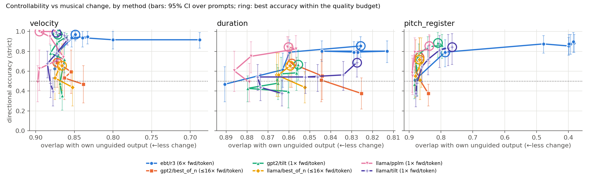
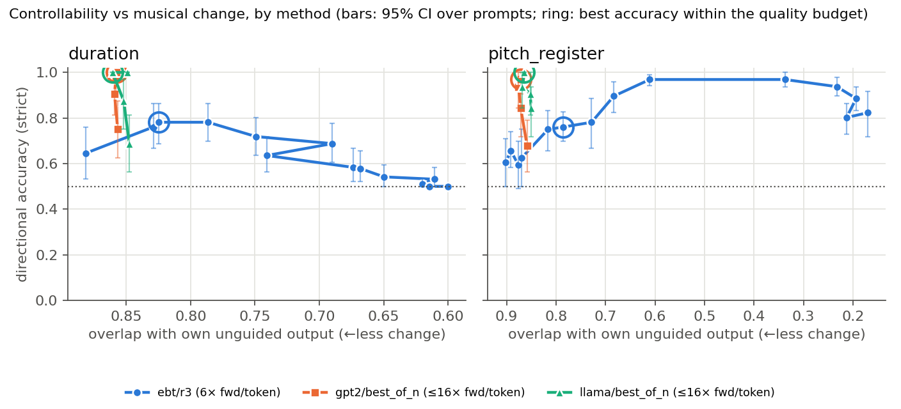

# Controllability vs musical cost: EBT guidance vs AR guidance baselines

_2026-10-09. Final checkpoints only (EBT REMI 33,732 / Ant s1 88,800; GPT-2 and
Llama final steps). Tools: `eval/score_sweep_quality.py`,
`eval/plot_guidance_sweeps.py tradeoff`. Raw results:
`figures/guidance_final/{remi,ant}/operating_points_and_curves.json`._

## Protocol
- Frozen models; guidance only at generation time. Same 16 prompts per
  tokenizer (REMI: the `sweep_tables/` ids; Anticipation: 16 control-free
  validation windows, commit 1802c3f), targets ±0.5/1/2 corpus SD around a
  3-draw per-prompt unguided baseline, T=0.7, top-p 0.9, 64-token prompt,
  256 generated.
- Methods: **EBT R³** (regressor energy added to EBT's MCMC refinement),
  **Llama PPLM** (one normalised gradient step on the logits through a
  regressor trained the same way on Llama's embeddings; REMI only),
  **tilt** (min-KL reweighting of the attribute's own REMI tokens via a
  hand-written value map; an oracle reference, REMI only), **best-of-N**
  (keep the closest of N unguided samples by the evaluation's own scorer).
- Strict directional accuracy (no movement = miss). 95% CIs by resampling
  prompts. Musical change = KDE overlap of 8 MIDI quality metrics with the
  same system's unguided output (OA_ung; ~0.85 = no detectable change at
  these sample sizes). Compute = forward-pass equivalents per generated
  token: tilt 1, PPLM ~1, best-of-N N, EBT 6 (2 MCMC steps × fwd+bwd).
- **Operating point** = best accuracy among strengths with harsh dissonance
  ≤ real mean + 1 SD and OA_ung ≥ 0.75.

## REMI

| operating point | velocity | duration | pitch_register | compute |
|---|---|---|---|---|
| **EBT R³** | 0.97 [0.91, 1.00] (λ 0.03) | **0.85** [0.74, 0.95] (λ 0.02) | 0.79 [0.65, 0.92] (λ 0.02) | 6 |
| Llama PPLM | 1.00 [1.00, 1.00] | 0.84 [0.72, 0.95] | 0.85 [0.71, 0.97] | 1 |
| tilt (oracle ref.) | 0.97–0.99 | 0.67–0.69 | 0.84–0.89 | 1 |
| best-of-16 | 0.66–0.69 | 0.66–0.68 | 0.72–0.74 | 16 |

- **Duration:** EBT and PPLM are tied (0.85 vs 0.84) and clearly above tilt
  and best-of-16 (~0.67). Note that tilt has direct access to the duration
  tokens.
- **Pitch register:** EBT is slightly below PPLM and tilt (0.79 vs
  0.85–0.89), within overlapping CIs, and its musical change is somewhat
  larger (OA_ung 0.79 vs 0.81–0.84).
- **Velocity:** EBT, PPLM and tilt all reach ~0.97–1.00. Velocity has no
  quality axis in these metrics.
- Best-of-N is weakest on REMI despite 16× compute: REMI continuations
  vary little in these attributes across draws.

## Anticipation (control-free prompts)

| | duration | pitch_register | compute |
|---|---|---|---|
| **EBT R³**, operating point | 0.78 [0.69, 0.86] (λ 0.005) | 0.76 [0.70, 0.83] (λ 0.01) | 6 |
| EBT, best accuracy at any cost | 0.78 | 0.97 (λ 0.02–0.04; OA_ung 0.61→0.34) | 6 |
| best-of-4 (≈ compute-matched) | 0.88–0.91 | 0.84–0.91 | 4 |
| best-of-16 | 1.00 | 0.97–1.00 | 16 |

- **Best-of-N beats EBT on Anticipation even at less compute** (N=4 <
  EBT's 6), with no musical change. Anticipation continuations vary a lot
  in these attributes from draw to draw, so selection alone works well.
- **EBT pitch_register guidance turns into cacophony:** above λ≈0.015
  accuracy rises to 0.97, but harsh dissonance goes 0.05 → 0.11 (λ 0.015)
  → 0.23–0.25 (λ ≥ 0.04). That is the level of uniformly random notes.
  The regressor's mean-pitch target is met by scattering notes. This is
  the source of the "cacophonic" guided samples heard earlier.
- **EBT duration is limited by a floor effect:** unguided duration ≈ 0.02,
  so "push down" targets are nearly unreachable. At higher λ every sample
  is pushed up (accuracy → 0.50 = all up-targets hit, all down-targets
  missed). Best-of-N side-steps this by picking the shortest draw.
- Pre-correction runs (prompts with anticipated controls, 2026-10-08
  morning) showed the same picture.

## Reading
- **Matched comparison (EBT vs Llama PPLM, both single-sample regressor
  gradients):** on REMI the two are statistically indistinguishable on all
  three attributes. EBT costs ~6× more compute per token.
- EBT's guidance is effective (≈0.8–1.0 accuracy within the quality
  budget on REMI). It is not more controllable than a gradient-steered AR
  baseline, and on Anticipation simple reranking is better.
- EBT's distinctive failure mode is that strong guidance can satisfy the
  regressor with musically incoherent output. This is detectable by the
  MIDI-level metrics, invisible to token-level ones (bigram_ll and gvr
  barely move).

## Caveats
- 16 prompts: CIs are ±0.08–0.20, so only large gaps are meaningful.
- The baselines are stronger base models (4–6× more training tokens, 2×
  context; `2026-10-05_tokens_matched_validation_loss.md`).
- REMI EBT λ grids were tuned by listening (Sept 22) on an older
  checkpoint, while the AR grids were not tuned. Anticipation EBT got a
  coarse + fine grid; best-of-N needed none.
- PPLM and tilt exist only for REMI, so Anticipation compares EBT with
  best-of-N only.
- Quality metrics ignore velocity; Anticipation duration down-targets hit
  a floor.
